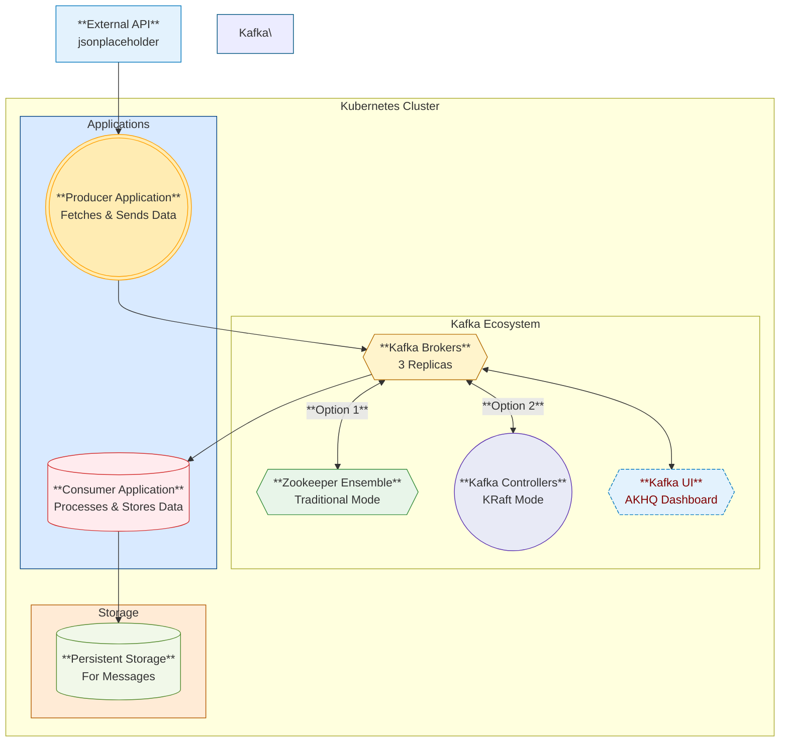

# Apache Kafka on Kubernetes Implementation

This repository contains a complete implementation of Apache Kafka on Kubernetes using Helm charts, along with producer and consumer applications. The project demonstrates two different approaches to deploying Kafka:

1. **Traditional Approach** using Zookeeper
2. **Modern Approach** using KRaft (Kafka Raft) without Zookeeper

## Table of Contents

- [Project Overview](#project-overview)
- [Prerequisites](#prerequisites)
- [Approach 1: Kafka with Zookeeper](#approach-1-kafka-with-zookeeper)
  - [Installation](#installation-with-zookeeper)
  - [Creating and Testing Topics](#creating-and-testing-topics-with-zookeeper)
- [Approach 2: Kafka with KRaft](#approach-2-kafka-with-kraft)
  - [Installation](#installation-with-kraft)
  - [Security Configuration](#security-configuration)
- [Apache Kafka HQ (AKHQ) UI Installation](#apache-kafka-hq-akhq-ui-installation)
- [Kafka Producer Implementation](#kafka-producer-implementation)
- [Kafka Consumer Implementation](#kafka-consumer-implementation)
  - [Basic Consumer](#basic-consumer)
  - [Offset Handling](#offset-handling)
- [Architecture Diagram](#architecture-diagram)
- [Troubleshooting](#troubleshooting)
- [References](#references)

## Project Overview

This project fulfills the requirements for Exercise #5, implementing a complete Kafka ecosystem on Kubernetes:

1. ✅ Installing Kafka server via Helm (Bitnami chart)
2. ✅ Installing Kafka UI (AKHQ)
3. ✅ Creating a Kafka producer that fetches and writes messages
4. ✅ Testing by browsing Kafka topics
5. ✅ Creating a Kafka consumer that reads messages and writes to a file
6. ✅ Implementing consumer with various offset configurations

## Prerequisites (Taken)

- K8s Cluster
- Helm 3.x
- `kubectl` CLI
- Docker for building container images
- Python 3.x for producer/consumer applications
- Lens (Optional)

## Approach 1: Kafka with Zookeeper

[Zookeeper Approach Repo](https://github.com/GigaSpaces-ProfessionalServices/eRAG-NOC/tree/sanskar/Sanskar/ZookeeperMode-Kafka)
### Installation with Zookeeper

First, create a configuration file for your Kafka deployment with Zookeeper:

```yaml
# kafka-values.yaml
image:
  debug: true

replicaCount: 3

tolerations:
  - key: "node-role.kubernetes.io/control-plane"
    operator: "Equal"
    value: ""
    effect: "NoSchedule"

externalAccess:
  enabled: false
  autoDiscovery:
    enabled: true

kraft:
  enabled: false

extraEnvVars:
  - name: KAFKA_ENABLE_KRAFT
    value: "false"

zookeeper:
  enabled: true
  replicaCount: 3
```


Install Kafka using Helm:

```bash
# Add Bitnami Helm repository
helm repo add bitnami https://charts.bitnami.com/bitnami

# Install Kafka with Zookeeper
helm -n kafka upgrade --install kafka-release bitnami/kafka \
  --create-namespace \
  --set persistence.size=8Gi,logPersistence.size=8Gi,volumePermissions.enabled=true,persistence.enabled=true,rbac.create=true \
  --version 23.0.7 \
  -f kafka-values.yaml
```

### Creating and Testing Topics with Zookeeper

Access one of the Kafka brokers:

```bash
kubectl exec --tty -i kafka-release-2 --namespace kafka -- bash
```

Create a test topic:

```bash
kafka-topics.sh --create --topic test1 --bootstrap-server kafka-release.kafka.svc.cluster.local:9092
```

Produce messages:

```bash
kafka-console-producer.sh --broker-list kafka-release-2.kafka-release-headless.kafka.svc.cluster.local:9092,kafka-release-1.kafka-release-headless.kafka.svc.cluster.local:9092,kafka-release-0.kafka-release-headless.kafka.svc.cluster.local:9092 --topic test1
```

Consume messages:


```bash
kafka-console-consumer.sh --bootstrap-server localhost:9092 --topic test1 --from-beginning
```


## Approach 2: Kafka with KRaft

[KRaft Approach Repo](https://github.com/GigaSpaces-ProfessionalServices/eRAG-NOC/tree/sanskar/Sanskar/KraftMode-Kafka)

### Installation with KRaft

Create a KRaft configuration file:

```yaml
# kafka-values-kraft.yaml
image:
  debug: true

replicaCount: 3

tolerations:
  - key: "node-role.kubernetes.io/control-plane"
    operator: "Equal"
    value: ""
    effect: "NoSchedule"

externalAccess:
  enabled: false
  autoDiscovery:
    enabled: true

kraft:
  enabled: true
  replicas: 3
  zookeeper:
    enabled: false

extraEnvVars:
  - name: KAFKA_ENABLE_KRAFT
    value: "true"
  - name: KAFKA_CFG_PROCESS_ROLES
    value: "controller,broker"
  - name: KAFKA_CFG_CONTROLLER_QUORUM_VOTERS
    value: "0@kafka-release-controller-0.kafka-release-controller-headless.kafka.svc.cluster.local:9093,1@kafka-release-controller-1.kafka-release-controller-headless.kafka.svc.cluster.local:9093,2@kafka-release-controller-2.kafka-release-controller-headless.kafka.svc.cluster.local:9093"
  - name: KAFKA_CFG_NODE_ID
    valueFrom:
      fieldRef:
        fieldPath: metadata.name
  - name: KAFKA_CFG_ADVERTISED_LISTENERS
    value: "PLAINTEXT://kafka-release.kafka.svc.cluster.local:9092"
  - name: KAFKA_CFG_LISTENERS
    value: "PLAINTEXT://:9092,CONTROLLER://:9093"
  - name: KAFKA_CFG_LISTENER_SECURITY_PROTOCOL_MAP
    value: "PLAINTEXT:PLAINTEXT,CONTROLLER:PLAINTEXT"
  - name: KAFKA_CFG_INTER_BROKER_LISTENER_NAME
    value: "PLAINTEXT"
  - name: KAFKA_CFG_CONTROLLER_LISTENER_NAMES
    value: "CONTROLLER"
  - name: KAFKA_CFG_DELETE_TOPIC_ENABLE
    value: "true"  # Allow topic deletion
  - name: KAFKA_CFG_AUTO_CREATE_TOPIC_ENABLE
    value: "true"  # Allow automatic topic creation
  - name: KAFKA_CFG_LOG_RETENTION_HOURS
    value: "168"  # Retain logs for 7 days
  - name: KAFKA_CFG_LOG_SEGMENT_BYTES
    value: "1073741824"  # 1GB log segment size
  - name: KAFKA_CFG_MESSAGE_MAX_BYTES
    value: "10485760"  # Allow 10MB max message size
  - name: KAFKA_CFG_NUM_PARTITIONS
    value: "3"  # Default topic partition count
  - name: KAFKA_CFG_DEFAULT_REPLICATION_FACTOR
    value: "3"  # Replication
```

Update Helm repository and install Kafka with KRaft:

```bash
# Update Helm repository
helm repo update

# See available versions
helm search repo bitnami/kafka --versions

# Install Kafka with KRaft
helm -n kafka upgrade --install kafka-release bitnami/kafka \
  --create-namespace \
  --set kraft.clusterId=ZTAxYTAzYzcyMzQ1NDM5Yj \
  --set persistence.size=8Gi,logPersistence.size=8Gi,volumePermissions.enabled=true,persistence.enabled=true,logPersistence.enabled=true,rbac.create=true \
  --version 26.9.0 \
  -f kafka-values-kraft.yaml
```

### Security Configuration

KRaft mode comes with SASL authentication enabled by default. Get the client password:

```bash
# Get the password
password="$(kubectl get secret kafka-release-user-passwords --namespace kafka -o jsonpath='{.data.client-passwords}' | base64 -d | cut -d , -f 1)"
echo $password
# Output: v2YYHRmR2a (example - your password will be different)
```

## Apache Kafka HQ (AKHQ) UI Installation

Create a configuration file for AKHQ with security settings:

```yaml
# akhq-secure-values.yaml
configuration:
  micronaut:
    security:
      enabled: true
      token:
        jwt:
          signatures:
            secret:
              generator:
                secret: 'NewLongerSecretStringWithAtLeast32Characters'
    server:
      cors:
        enabled: true
        configurations:
          all:
            allowedOrigins:
              - "*"
  akhq:
    connections:
      local:
        properties:
          bootstrap.servers: "kafka-release.kafka.svc.cluster.local:9092"
          security.protocol: "SASL_PLAINTEXT"
          sasl.mechanism: "SCRAM-SHA-256"
          sasl.jaas.config: >-
            org.apache.kafka.common.security.scram.ScramLoginModule required username='user1' password='v2YYHRmR2a';

        # Security configuration
        security:
          default-group:
            - no-roles  # Default groups for all users even unlogged users
          groups:
            admin:  # unique key
              name: admin  # Group name
              roles:  # roles for the group
                - topic/read
                - topic/insert
                - topic/delete
                - topic/config/update
                - node/read
                - node/config/update
                - topic/data/read
                - topic/data/insert
                - topic/data/delete
                - group/read
                - group/delete
                - group/offsets/update
                - registry/read
                - registry/insert
                - registry/update
                - registry/delete
                - registry/version/delete
                - acls/read
                - connect/read
                - connect/insert
                - connect/update
                - connect/delete
                - connect/state/update
            reader:  # unique key
              name: reader  # Group name
              roles:  # roles for the group
                - topic/read
                - node/read
                - topic/data/read
                - group/read
                - registry/read
                - acls/read
                - connect/read

# Basic auth configuration
basic-auth:
  - username: admin
    password: >-
      8c6976e5b5410415bde908bd4dee15dfb167a9c873fc4bb8a81f6f2ab448a918  # SHA-256 for 'admin'
    groups:
      - admin
  - username: reader
    password: >-
      3d0941964aa3ebdcb00ccef58b1bb399f9f898465e9886d5aec7f31090a0fb30  # SHA-256 for 'reader'
    groups:
      - reader
```

Install AKHQ using Helm:

```bash
# Clone repositories
git clone https://github.com/tchioludo/akhq.git

# Install AKHQ
helm upgrade --install kafka-akhq \
  --namespace kafka \
  --create-namespace \
  --wait \
  -f akhq-secure-values.yaml \
  ./akhq/helm/akhq
```


## Kafka Producer Implementation

Here's a Python implementation of a Kafka producer that fetches user data from an API and sends it to a Kafka topic:

```python
# producer.py
from kafka import KafkaProducer
import requests
import json
import time

# Kafka broker details
KAFKA_BROKER = "kafka-release.kafka.svc.cluster.local:9092"
TOPIC_NAME = "test1"

# Configure the producer
producer = KafkaProducer(
    bootstrap_servers=KAFKA_BROKER,
    security_protocol="SASL_PLAINTEXT",
    sasl_mechanism="SCRAM-SHA-256",
    sasl_plain_username="user1",
    sasl_plain_password="v2YYHRmR2a",
    value_serializer=lambda v: json.dumps(v).encode('utf-8')
)

# Function to fetch users and send to Kafka
def fetch_and_produce():
    for user_id in range(1, 11):  # Fetch first 10 users
        response = requests.get(f"https://jsonplaceholder.typicode.com/users/{user_id}")
        if response.status_code == 200:
            user_data = response.json()
            producer.send(TOPIC_NAME, user_data)
            print(f"Sent: {user_data}")
        time.sleep(2)  # Avoid API rate limits

fetch_and_produce()
producer.flush()
producer.close()
```

Deploy the producer using Kubernetes:

```yaml
# producer-deployment.yaml
apiVersion: apps/v1
kind: Deployment
metadata:
  name: kafka-producer
  namespace: kafka
spec:
  replicas: 1
  selector:
    matchLabels:
      app: kafka-producer
  template:
    metadata:
      labels:
        app: kafka-producer
    spec:
      containers:
      - name: kafka-producer
        image: python:3.9
        command: ["sh", "-c", "pip install kafka-python requests && python /app/producer.py"]
        volumeMounts:
        - name: producer-script
          mountPath: /app
      volumes:
      - name: producer-script
        configMap:
          name: kafka-producer-script
---
apiVersion: v1
kind: ConfigMap
metadata:
  name: kafka-producer-script
  namespace: kafka
data:
  producer.py: |
    from kafka import KafkaProducer
    import requests
    import json
    import time

    # Kafka broker details
    KAFKA_BROKER = "kafka-release.kafka.svc.cluster.local:9092"
    TOPIC_NAME = "test1"

    # Configure the producer
    producer = KafkaProducer(
        bootstrap_servers=KAFKA_BROKER,
        security_protocol="SASL_PLAINTEXT",
        sasl_mechanism="SCRAM-SHA-256",
        sasl_plain_username="user1",
        sasl_plain_password="v2YYHRmR2a",
        value_serializer=lambda v: json.dumps(v).encode('utf-8')
    )

    # Function to fetch users and send to Kafka
    def fetch_and_produce():
        for user_id in range(1, 11):  # Fetch first 10 users
            response = requests.get(f"https://jsonplaceholder.typicode.com/users/{user_id}")
            if response.status_code == 200:
                user_data = response.json()
                producer.send(TOPIC_NAME, user_data)
                print(f"Sent: {user_data}")
            time.sleep(2)  # Avoid API rate limits

    fetch_and_produce()
    producer.flush()
    producer.close()
```

Apply the deployment:

```bash
kubectl apply -f producer-deployment.yaml
kubectl rollout restart deployment kafka-producer -n kafka
```


## Kafka Consumer Implementation

### Basic Consumer

First, create a PVC for storing messages:

```yaml
# kafka-consumer-pvc.yaml
apiVersion: v1
kind: PersistentVolumeClaim
metadata:
  name: kafka-messages-pvc
  namespace: kafka
spec:
  accessModes:
    - ReadWriteOnce
  resources:
    requests:
      storage: 1Gi  # Adjust size as needed
```

Create a Kafka consumer that writes messages to a file:

```python
# kafka_consumer.py
from kafka import KafkaConsumer
import json
import os

# Kafka consumer setup
consumer = KafkaConsumer(
    'test1',  # Change to your topic name
    bootstrap_servers=['kafka-release.kafka.svc.cluster.local:9092'],
    security_protocol="SASL_PLAINTEXT",
    sasl_mechanism="SCRAM-SHA-256",
    sasl_plain_username="user1",
    sasl_plain_password="v2YYHRmR2a",
    auto_offset_reset='earliest',  # Options: 'earliest', 'latest', 'none'
    enable_auto_commit=True
)

output_file = "/app/messages.txt"  

# Ensure the directory exists
os.makedirs(os.path.dirname(output_file), exist_ok=True)

print("Consumer is running...")

with open(output_file, "a") as f:
    for message in consumer:
        data = json.loads(message.value.decode("utf-8"))
        print(f"Received: {data}")
        f.write(json.dumps(data) + "\n")
```

Deploy the consumer:

```yaml
# consumer-deployment.yaml
apiVersion: apps/v1
kind: Deployment
metadata:
  name: kafka-consumer
  namespace: kafka
spec:
  replicas: 1
  selector:
    matchLabels:
      app: kafka-consumer
  template:
    metadata:
      labels:
        app: kafka-consumer
    spec:
      containers:
        - name: kafka-consumer
          image: your-registry/kafka-consumer:latest  # Replace with your actual image
          command: ["python", "/app/kafka_consumer.py"]
          volumeMounts:
            - name: messages-storage
              mountPath: /data  # This will store messages persistently
      volumes:
        - name: messages-storage
          persistentVolumeClaim:
            claimName: kafka-messages-pvc
```

Build and deploy:

```bash
docker build -t your-registry/kafka-consumer:latest .
docker push your-registry/kafka-consumer:latest
kubectl apply -f consumer-deployment.yaml
kubectl rollout restart deployment kafka-consumer -n kafka
```


### Offset Handling

#### Auto Offset Reset

You can configure the `auto_offset_reset` parameter in your consumer code to control where consumption starts:

```python
KafkaConsumer(
    'test1',
    bootstrap_servers=['kafka-release.kafka.svc.cluster.local:9092'],
    security_protocol="SASL_PLAINTEXT",
    sasl_mechanism="SCRAM-SHA-256",
    sasl_plain_username="user1",
    sasl_plain_password="v2YYHRmR2a",
    auto_offset_reset='earliest',  # 'earliest' | 'latest' | 'none'
    enable_auto_commit=False  # Disable auto commit for manual control
)
```

Options:
- `'earliest'` - Starts from the oldest message
- `'latest'` - Starts from new messages only
- `'none'` - Fails if no previous offset is stored

#### Manual Offset Control

For more precise control, you can manually seek to specific offsets:

```python
from kafka import KafkaConsumer, TopicPartition

consumer = KafkaConsumer(
    bootstrap_servers=['kafka-release.kafka.svc.cluster.local:9092'],
    security_protocol="SASL_PLAINTEXT",
    sasl_mechanism="SCRAM-SHA-256",
    sasl_plain_username="user1",
    sasl_plain_password="v2YYHRmR2a",
    enable_auto_commit=False  # Manual offset control
)

topic = 'test1'
partition = 0  # Change if using multiple partitions
tp = TopicPartition(topic, partition)

consumer.assign([tp])  # Assign to specific partition
consumer.seek(tp, 5)  # Start from offset 5

print("Consumer is running from offset 5...")
for message in consumer:
    print(f"Received: {message.value.decode()}")
```


## Architecture Diagram

```
+---------------------+    +------------------------+    +---------------------+
|                     |    |                        |    |                     |
|    Kafka Brokers    |<-->|   Zookeeper Ensemble   |    |   Kafka UI (AKHQ)   |
|    (3 Replicas)     |    |     (Traditional)      |    |                     |
|                     |    |                        |    |                     |
+----------+----------+    +------------------------+    +---------+-----------+
           ^                                                       ^
           |                                                       |
           v                                                       v
+----------+----------+                                +-----------+-----------+
|                     |                                |                       |
|  Kafka Controllers  |                                | Producer Application  |
|   (KRaft Mode)      |                                | (API to Kafka)        |
|                     |                                |                       |
+----------+----------+                                +-----------+-----------+
           ^                                                       |
           |                                                       |
           |                                                       v
           |                                           +-----------+-----------+
           |                                           |                       |
           +------------------------------------------>|  Consumer Application  |
                                                       |  (Kafka to File)      |
                                                       |                       |
                                                       +-----------------------+
```

### Enhanced Architecture Diagram (Flowchart)



## Troubleshooting

### Common Issues

1. **Connection Errors**:
   - Verify network connectivity between pods
   - Check if service names and ports are correct
   - Ensure SASL credentials are correct

2. **Authentication Failures**:
   - Verify the SASL mechanism matches (SCRAM-SHA-256 vs SCRAM-SHA-512)
   - Check if username and password are correct
   - Confirm JAAS configuration format

3. **Topic Creation Issues**:
   - Check if `auto.create.topics.enable` is set to true
   - Verify you have proper permissions
   - Check controller logs for any errors

### Debugging Commands

```bash
# Check Kafka pods
kubectl get pods -n kafka

# Check logs of a specific pod
kubectl logs <pod-name> -n kafka

# Check Kafka broker configuration
kubectl exec -it <kafka-pod> -n kafka -- cat /opt/bitnami/kafka/config/server.properties

# Check consumer group offsets
kubectl exec -it <kafka-pod> -n kafka -- kafka-consumer-groups.sh --bootstrap-server localhost:9092 --describe --group <consumer-group>
```

### IMP Commands to direct run -

```bash
kubectl apply -f producer-deployment.yaml
kubectl rollout restart deployment kafka-producer -n kafka
kubectl apply -f consumer-deployment.yaml
kubectl rollout restart deployment kafka-consumer -n kafka
```

## References

- [Apache Kafka Documentation](https://kafka.apache.org/documentation/)
- [Bitnami Kafka Helm Chart](https://github.com/bitnami/charts/tree/main/bitnami/kafka)
- [KRaft Mode Documentation](https://kafka.apache.org/documentation/#kraft)
- [AKHQ Documentation](https://akhq.io/)
- [Kafka Python Client](https://kafka-python.readthedocs.io/)
